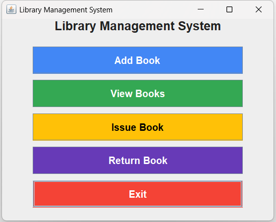
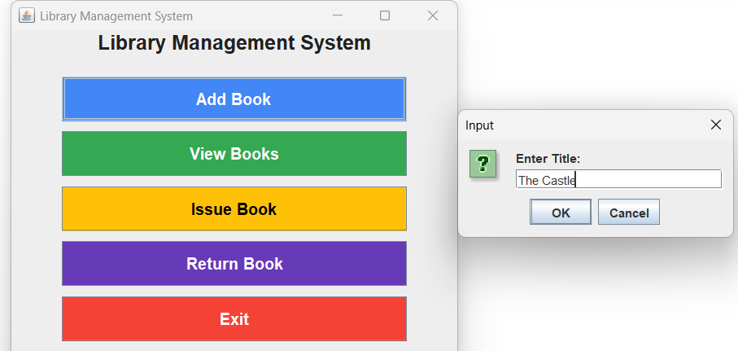
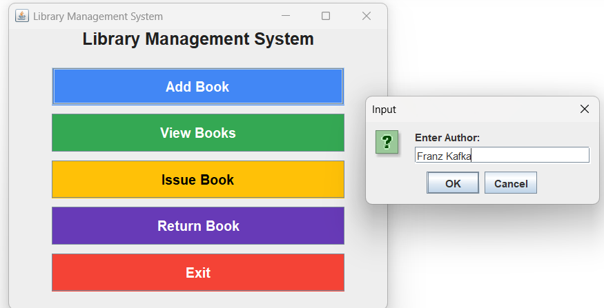
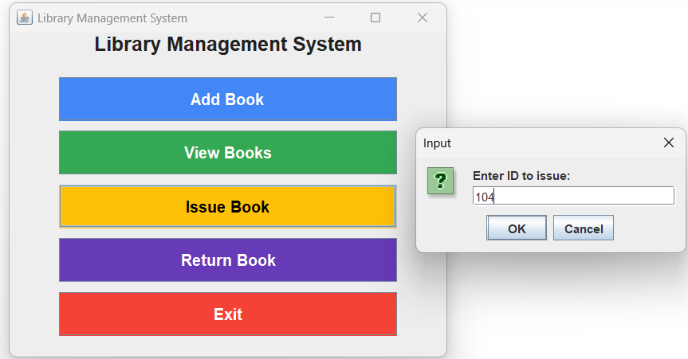
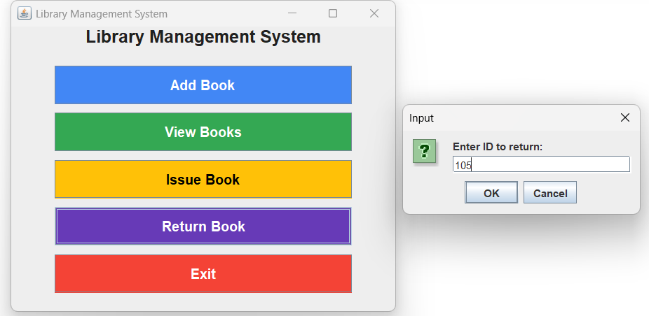

# 📚 Library Management System (Java Swing)

A beginner-friendly **Library Management System** built using **Java Swing**.  
This project demonstrates **core Java concepts**, **GUI programming**, and **basic file handling**.

---

## 🚀 Features

- **Add Book** – Add a new book to the library database.  
- **View Books** – Display all available books in a structured format.  
- **Issue Book** – Issue a book to a user and update the records.  
- **Return Book** – Return an issued book and update availability.  
- **Exit** – Close the application safely.  

---

## 🖥️ Tech Stack

- **Language:** Java  
- **GUI:** Java Swing  
- **Data Storage:** Text File (`books.txt`)  
- **IDE Used:** VS Code / IntelliJ IDEA / Eclipse
    
---

## 🖼️ UI Preview
### Home Page

### Add Book Feature

### View Books

### Issue Book

### Return Book

---

## ⚡ How It Works

- The app uses **Swing** for the interface.
- Book details are stored in a **text file** for persistence.
- Each button (`Add`, `View`, `Issue`, `Return`) opens a new dialog for user interaction.

---

## 📦 How to Run

1. Clone this repository.
2. Open in any Java IDE (e.g., VS Code, IntelliJ, Eclipse).
3. Run the `LibraryGUI.java` file.
4. You’re good to go!
